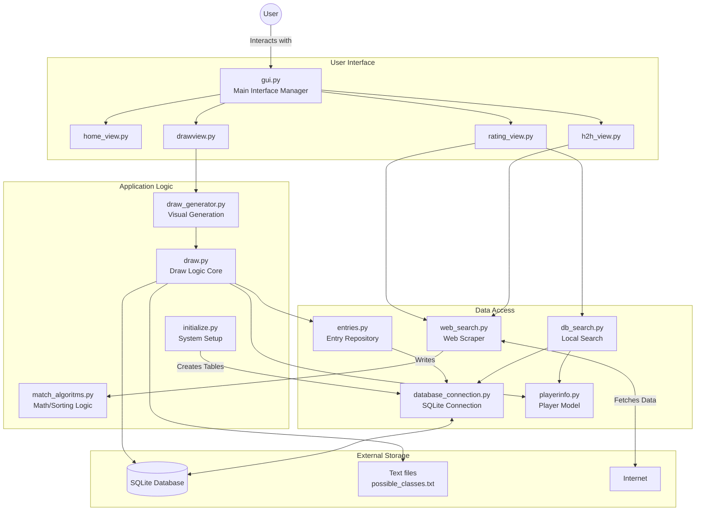
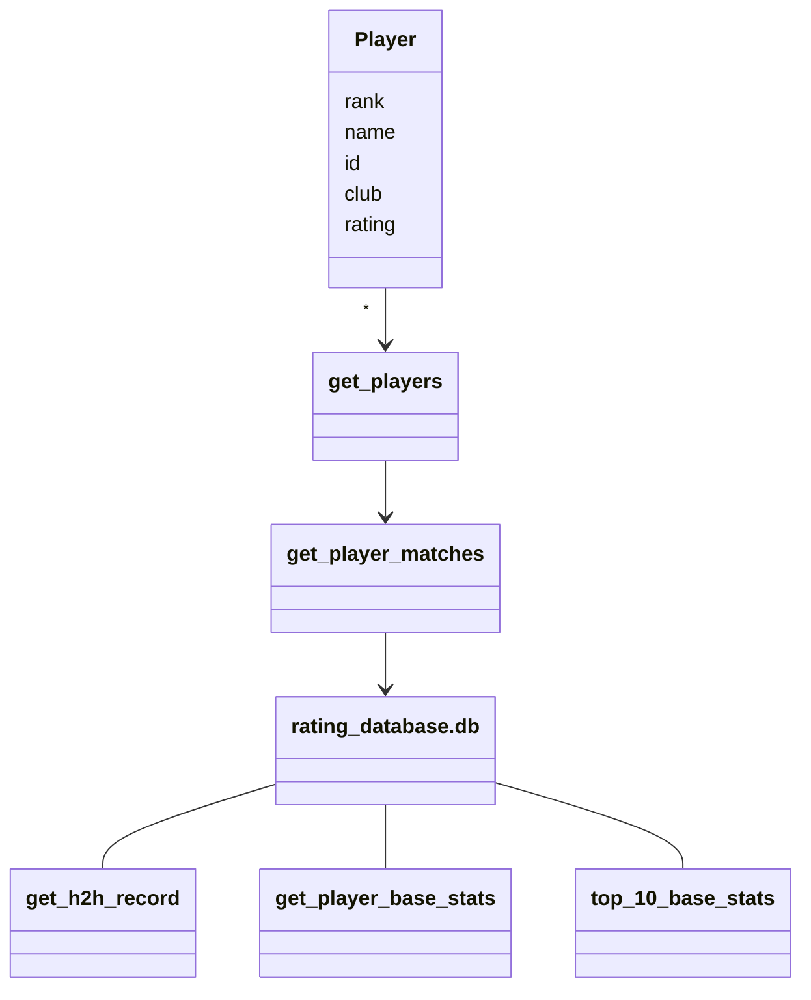
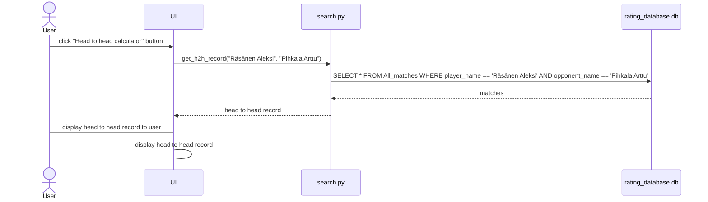

#Arkkitehtuurikuvaus

## Rakenne

Alla on korkean tason arkkitehtuurikuvaus sovelluksen pääsovelluslogiikasta



Sovellus toimii lähinnä tietokantatoiminnoilla, tietokantakyselyillä ja statistiikkoja laskevilla algoritmeilla, tärkein luokkamuuttuja on Player, johon tallennetaan pelaajan perustiedot.
Alla näkyy luokan toiminta muiden funktioiden kanssa:


## Käyttöliittymä

Sovelluksessa kaikki ovat normaaleja käyttäjiä ja sovelluksessa on neljä näkymää; kotinäkymä, ratinglista, draw generator ja head to head calculator
Kotinäkymässä on napit:
- `Ratinglist`
- `Head to head calculator`
- `Draw generator`

Ratinglist käyttää db_search.py:n funktiota get_player_basestats(name) ja palauttaa jokaisen top 100 pelaajan perustatistiikat alkunäkymään. Head to head calculator käyttää db_search.py:n funktiota get_h2h_record(player1, player2) ja palauttaa kahden pelaajan välisen ottelusuhteen näkymään.
Draw generator käyttää draw_generator.py:n funktiota generate(filename, date), joka luo Draw luokkamuuttujan ja kutsuu draw.py:n funktioita luomaan arvonnan. Ennen tätä kutsutaan entries.py:n funktiota get_player_classes_from_file(file_path), joka lukee ilmoittautumiset annetusta ilmoittautumis excel tiedostosta.

 
Head to head recordin näyttäminen käyttäjälle on kuvattu seuraavassa sekvenssikaaviossa:




##Sovelluslogiikka

Applikaation pääsovelluslogiikan hoitaa lähinnä kolme tiedostoa: db_search.py, web_search.py ja match_algoritms.py.
db_search.py nimensä mukaisesti hakee tietoja tietokannasta ja palauttaa niitä ylempien tasojen komponenteille, esim. jos käytetään head to head calculatoria. web_search.py hakee pelaajien pelaamia matseja ja ratinglistoja netistä. Pelaajien pelaamat matsit haetaan kun suoritetaan initialize.py (invoke init).
web_search.py tekee pyyntöjä match_algoritms.py:lle jäsentääkseen matsien tuloksia tietokantaan kirjoittamista varten. 
Näiden kolmen tiedoston toiminta on kuvattu alla:

```mermaid
flowchart TD
   db_search---|reads|[(database)]
   web_search-- inserts -->[(database)]
   web_search --- match_algoritms
```
  
