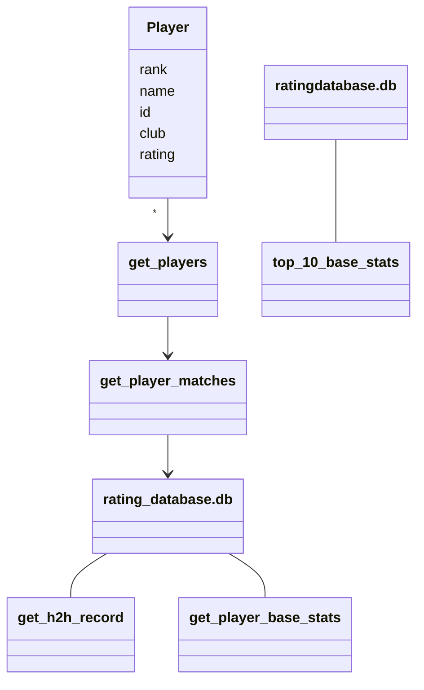

#Arkkitehtuurikuvaus

## Rakenne

Sovellus toimii lähinnä tietokantatoiminnoilla, tietokantakyselyillä ja statistiikkojen laskemisella, jolloin tällä hetkellä on vain yksi luokkamuuttuja Player, johon tallennetaan pelaajan perustiedot.
Alla näkyy luokan toiminta muiden funktioiden kanssa:

## Käyttöliittymä

Sovelluksessa kaikki ovat normaaleja käyttäjiä ja tällä hetkellä on vain yksi näkymä; alkunäkymä, joka toimii tiedostossa index.py
Alkunäkymässä on toiminnot:
- `basestats`
- `h2h`
- `top10`

Basestats käyttää search.py:n funktiota get_player_basestats(name) ja palauttaa pelaajan perustatistiikat alkunäkymään. h2h käyttää search.py:n funktiota get_h2h_record(player1, player2) ja palauttaa kahden pelaajan välisen ottelusuhteen alkunäkymään
top10 iteroi funktiota get_player_basestats(name).

 
