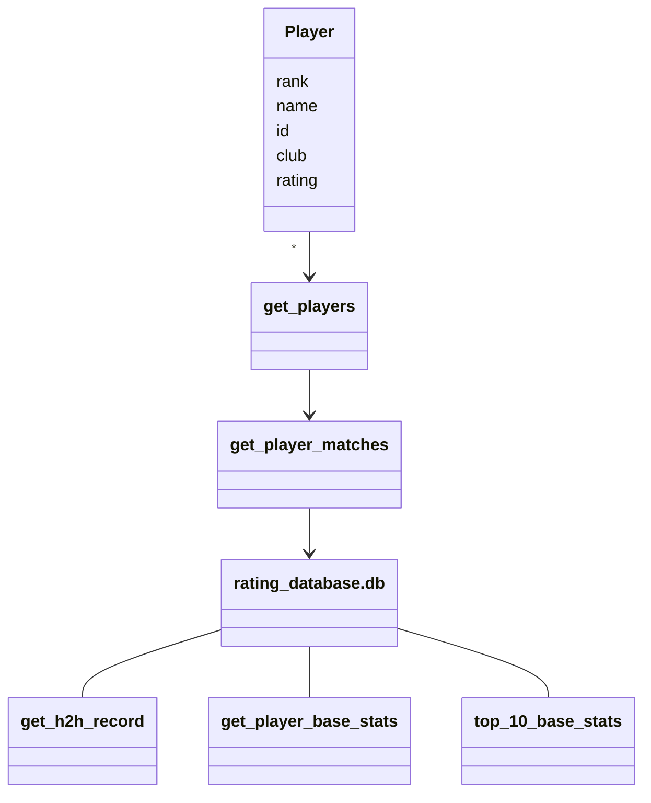

#Arkkitehtuurikuvaus

## Rakenne

Sovellus toimii lähinnä tietokantatoiminnoilla, tietokantakyselyillä ja statistiikkojen laskemisella, jolloin tällä hetkellä on vain yksi luokkamuuttuja Player, johon tallennetaan pelaajan perustiedot.
Alla näkyy luokan toiminta muiden funktioiden kanssa:

## Käyttöliittymä

Sovelluksessa kaikki ovat normaaleja käyttäjiä ja tällä hetkellä on kolme näkymää; kotinäkymä, ratinglista ja head to head calculator
Kotinäkymässä on napit:
- `Ratinglist`
- `Head to head calculator`

Ratinglist käyttää search.py:n funktiota get_player_basestats(name) ja palauttaa jokaisen top 100 pelaajan perustatistiikat alkunäkymään. Head to head calculator käyttää search.py:n funktiota get_h2h_record(player1, player2) ja palauttaa kahden pelaajan välisen ottelusuhteen näkymään

 
