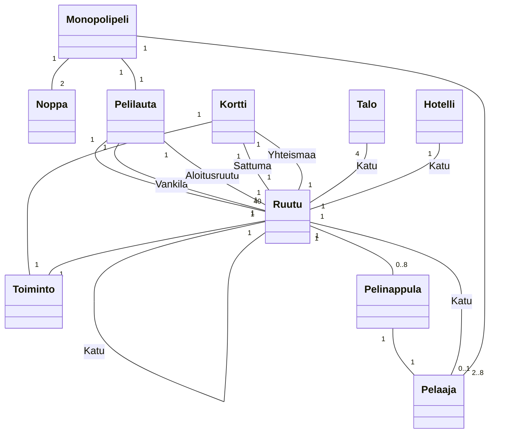

## Monopoli, alustava luokkakaavio

```mermaid
 classDiagram
    Monopolipeli "1" -- "2" Noppa
    Monopolipeli "1" -- "1" Pelilauta
    Pelilauta "1" -- "40" Ruutu
    Ruutu "1" -- "1" Ruutu : seuraava
    Ruutu "1" -- "1" Ruutu : Aloitusruutu
    Ruutu "1" -- "1" Ruutu : Vankila
    Pelilauta "1" -- "1" Ruutu : Vankila
    Pelilauta "1" -- "1" Ruutu : Aloitusruutu
    Ruutu "1" -- "1" Ruutu : Sattuma
    Ruutu "1" -- "1" Ruutu : Yhteismaa
    Ruutu "1" -- "1" Ruutu : Asema
    Ruutu "1" -- "1" Ruutu : Laitos
    Ruutu "1" -- "1" Ruutu : Katu
    Kortti "1" -- "1" Ruutu : Sattuma
    Kortti "1" -- "1" Ruutu : Yhteismaa
    Kortti "1" -- "1" Toiminto
    Ruutu "1" -- "1" Toiminto
    Ruutu "1" -- "0..8" Pelinappula
    Talo "4" -- "1" Ruutu : Katu
    Hotelli "1" -- "1" Ruutu : Katu
    Pelaaja "0..1" -- "1" Ruutu : Katu
    Pelinappula "1" -- "1" Pelaaja
    Pelaaja "2..8" -- "1" Monopolipeli
```
